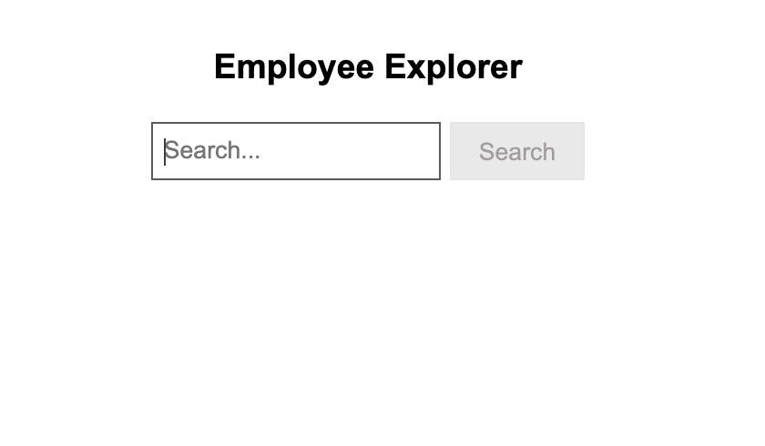
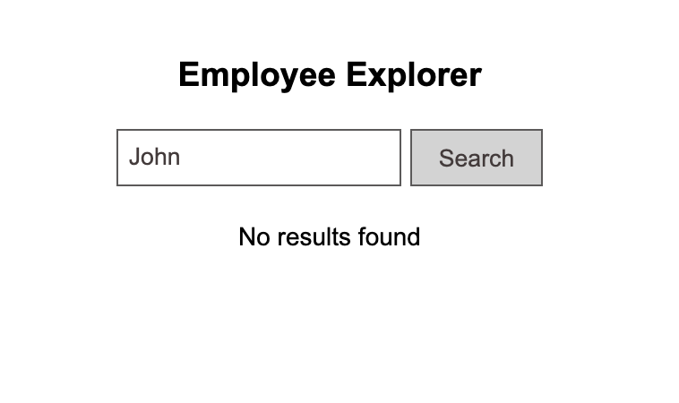
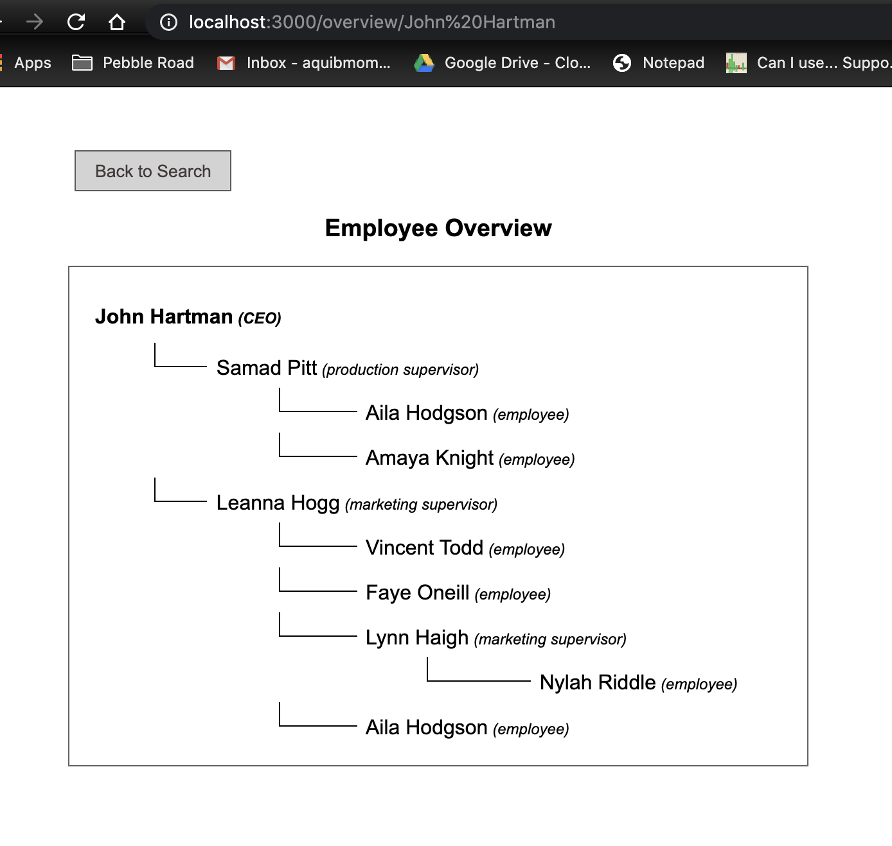

# Employee Explorer
create-react-app cli is used to create this Employee Explorer App.
## Git Repository to Boilerplate
```bash
https://github.com/facebook/create-react-app
```

# Additional Setup
* Typescript support added
* SCSS is used for styling
* React Icons are used
* node version >= 12.0.0


```bash
https://github.com/aquibmomin007/employee-search
```

## 1. Setup
- install all dependencies
```bash
npm install
or 
yarn install
```
- to start the project locally
```bash
npm run start
or 
yarn start
```
- to create an optimized build
```bash
npm run build
or 
yarn build
```

## 2. Stories
- **As a user, I am able to search for employees**<br/>
User can search for the name of the Employee by the name. 
  <br/>
In case of no result, **No results found** message will be displayed
  

- **As a user, I want to know for a given employee who works directly for that given employee (direct re-ports) and who indirectly works for that given employee (all subordinates of structured tree)**<br />
If result found, the route will be directed to **http://localhost:3000/overview/{name}** to display employee overview component which shows the heirarchy of the searched employee subordinates
  
  
- **As a user, I am able to share or bookmark a link to the overview page of a given employee**<br />
The url can be bookmarked and directly copy pasted to load the employee overview<br />
**FORMAT: http://localhost:3000/overview/{name}**
  
  
